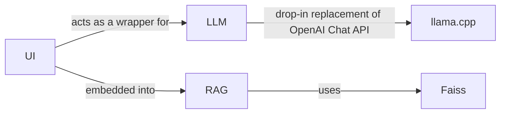

# YaCy Expert

Inspired by the vision of the talks, "[Search Engines History and Future](https://yacy.net/material/20160430_Search_Engines_Of_The_Future_OpenTechSummit_2016.pdf)" (FOSSASIA Singapore 2016 [video](https://www.youtube.com/watch?v=6_rMjXjD_4Y)) and "[Search Engines of the Future](https://yacy.net/material/20160904_The_Future_of_Search_QtCon_2016.key)" (QtCon Berlin 2016) this project aims to bring that vision of a "future search engine" to life. The prediction of both talks had been:

*"Future search engines will answer to all questions!"*

[Large Language Models](https://cdn.openai.com/better-language-models/language_models_are_unsupervised_multitask_learners.pdf) (LLMs) today provide a new approach to answer to all questions. The concept of a combination of LLMs with Search Engines is described as [Retrieval Augmented Generation](https://arxiv.org/pdf/2005.11401.pdf) (RAG). Search engines with exact-match, similar-match (i.e. using [Levenshtein distance](https://dl.acm.org/doi/pdf/10.1145/363958.363994)), or synonym-match full-text indexing (i.e. frameworks using Lucene or similar technologies) are not sufficient to match a Instruct query (a "prompt") semantically with a text corpus, that is used to provide a context to the prompt. Instead, a [dense vector similarity search on embeddings](https://engineering.fb.com/2017/03/29/data-infrastructure/faiss-a-library-for-efficient-similarity-search/) is the right approach to implement RAG.

In this repository we are building a search portal that leverages the power of both Large Language Models (LLM) and Retrieval Augmented Generation (RAG) to create a comprehensive, responsive, and cutting-edge search engine that fulfills the promise of the prediction above.

## Motivation

YaCy users are able to acquire large text corpora using web crawling and also by importing large data dumps provided as WARC or ZIM file.
This project will use specifically the data dump files from YaCy to create context-delivery to LLMs using RAG.

Data acquisition with YaCy then becomes a pre-processing step to create an expert-like chatbot, which is specifically potent in the knowledge domain of the YaCy web crawls. This motivates to name this project "YaCy Expert".

Not only the naming but also the approach follows the (old) AI concept of "Expert Systems" in the tradition of "[General Problem Solving](http://bitsavers.informatik.uni-stuttgart.de/pdf/rand/ipl/P-1584_Report_On_A_General_Problem-Solving_Program_Feb59.pdf)" (1958), "[A model of inexact reasoning in medicine](https://www.sciencedirect.com/science/article/abs/pii/0025556475900474?via%3Dihub)" (1975) and "[Internist-I, an Experimental Computer-Based Diagnostic Consultant for General Internal Medicine](https://www.nejm.org/doi/full/10.1056/NEJM198208193070803)" (1982). This concept divides the expert system into two subsystems: the inference engine and the knowledge base. This is reflected in the YaCy Expert architecture.

## Architecture

*YaCy Expert* provides a web interface that acts as a wrapper for two separate backend services: a LLM (acting as the inference engine of the expert system) and a RAG system (acting as the knowledge base of the expert system). The LLM is hosted as a drop-in replacement of the OpenAI chat API using llama.cpp and the RAG system is embedded into the server back-end of the YaCy Expert web interface.



## Requirements

This is a python project. It should run on Linux, macOS and Windows and it can also run in a distributed environment where the LLM is hosted separately. You need:

- one server running python
- another (or the same) server running a LLM, either natively (recommended on Mac) or in a docker container (e.g. on Windows or Linux).
- one or more YaCy index dump(s)
- RAM for the LLM and the Vector index; both can be very large. We recommend a lot of RAM (64GB and above).

Although designed for powerful hardware (macOS or Linux with GPU), we are also working on a proof-of-concept installation for two Raspberry Pi SBCs.

## Installation

(this is a stub)

You must go through the following steps:
- provide data for a vector search
- do indexing of the provided data
- provide a LLM backend
- run the yacy_expert backend server
- open the chat web page to talk to the expert

### Provide knowledge as Vector Search Index

We use a Faiss index here. The index is provided by the following scripts:

```
knowledge_indexing_faiss.py
knowledge_search_server.py
```

The first script generates a Faiss index, the second one provides access to the index with a flask web server.

#### Place a YaCy data dump in the `knowledge` subdirectory

Run your YaCy instance and generate a search index. This search index defines the corpus of the knowledge that you want to use to enrich YaCy Expert using RAG. When you believe that your index is well-curated, do an index export:
- click on "Index Export/Import" (`/IndexExport_p.html`)
- keep the default export settings and use "Full Data Records"; click on "Export" and wait until the export is finished.
- Copy the exported `.jsonlist` file from YaCy `DATA/EXPORT/` path to the `knowledge` path inside this repository

#### Run the Faiss indexing to turn the data dumps into vector index files

The Faiss index is applied on all `.jsonlist` files inside the `knowledge` path.

- indexing uses a [BERT](https://blog.research.google/2018/11/open-sourcing-bert-state-of-art-pre.html) language model to tokenize texts and to compute embeddings. Such embeddings can be optimized by choosing the right BERT model. The default model [`bert-base-multilingual-uncased`](https://huggingface.co/bert-base-multilingual-uncased) can be replaced with a custom model that can be declared in a `.ini` file. For each `jsonlist`/`jsonl` file you may create a file `<filename>.jsonlist.ini` with declaration of a wanted model, e.g. for a [german BERT model](https://huggingface.co/dbmdz/bert-base-german-uncased):
```
[DEFAULT]
model_name = dbmdz/bert-base-german-uncased
dimension = 768
``` 
- run `python3 knowledge_indexing.py`. This is a long-running process which takes about 1 hour for 10000 index entries - depends on the speed of your computer (best speed is 4x of this). A multi-million-sized index may take several days or weeks!

The produced index files with extension `.faiss` are also inside the `knowledge` path. Running the `knowledge_indexing.py` script again will not compute already produced faiss index files again.

#### (optional) Run a Faiss Search Server (for testing)

The Faiss index shall be used as RAG context provider, but we provide a like-YaCy search API that can run separately!

- run `python3 knowledge_search_faiss.py`. This will set up a web server which provides a search API at `http://localhost:8094/yacysearch.json`. You can search i.e. with the url [`http://localhost:8094/yacysearch.json?query=one%20two%20three&count=3`](http://localhost:8094/yacysearch.json?query=one%20two%20three&count=3) -- this is the same path as in YaCy. You can use the same html front-ends for the search.
- open `knowledge_search_html/index.html`. This will provide you with a very simple test search interface which uses the knowledge_search_server to retrieve documents from the Faiss Vector Index.

### Provide a LLM backend

The 'industrial' way to get the LLM backend is to use the OpenAI API.
We want to be independed from a commercial solution but our own solution shall be compatible to the OpenAI API. However, to prove that this way is compatible, one of the options here must actually be the commercial binding to the OpenAI interface. That means we have two options:

#### Configure access to OpenAI API

#### Install our own LLM backend
  - copy a language model in the `model` subdirectory
  - build the docker image containing the llama.cpp framework
  - start the llama.cpp docker container with the OpenAI API

### build the web interface of YaCy Expert

### run YaCy Expert by starting the web server backend
